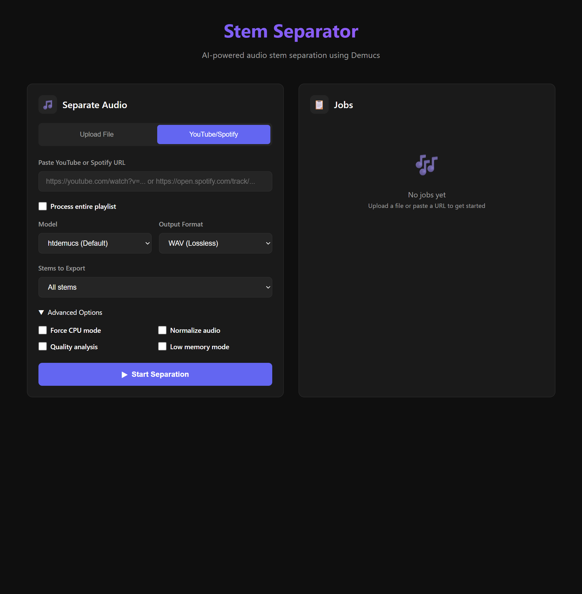

# Stem Separator

Separates audio into vocals, drums, bass, and other instruments using [Demucs](https://github.com/facebookresearch/demucs) by Meta Research.

## Features

- **AI-Powered Separation**: Uses state-of-the-art Demucs models for high-quality stem separation
- **Multiple Models**: Support for 4-stem and 6-stem (guitar + piano) models
- **Multiple Formats**: Output as WAV, MP3, FLAC, OGG, or AAC
- **YouTube Support**: Download and process YouTube videos directly, including playlists
- **Spotify Support**: Download and process Spotify tracks (requires spotdl)
- **Batch Processing**: Process entire directories of audio files
- **Custom Remixing**: Mix stems with custom volume levels
- **Audio Preview**: Preview separated stems before saving
- **GPU Acceleration**: Automatic GPU detection for faster processing
- **Metadata Preservation**: Preserve ID3 tags from source files
- **Configuration File**: Save your preferences in `~/.stem-separator.yaml`

## Installation

### Quick Install

**Windows:**
```batch
install.bat
```

**Linux/macOS:**
```bash
chmod +x install.sh && ./install.sh
```

### Manual Install

1. **Install FFmpeg** (required):
   ```bash
   # Windows
   winget install FFmpeg.FFmpeg

   # macOS
   brew install ffmpeg

   # Linux (Debian/Ubuntu)
   sudo apt install ffmpeg
   ```

2. **Install Python packages**:
   ```bash
   pip install demucs yt-dlp soundfile scipy pyyaml rich
   ```

3. **Optional dependencies**:
   ```bash
   # Spotify support
   pip install spotdl

   # Audio preview
   pip install sounddevice

   # Enhanced metadata handling
   pip install mutagen
   ```

### Install as Package (Recommended)

```bash
pip install -e .
```

This enables:
- Running as `stem-separator song.mp3` or `stems song.mp3`
- Running as `python -m stem_separator song.mp3`

### Docker (Recommended for Easy Setup)

Run with Docker for the easiest setup - no dependencies to install:

```bash
# CPU mode (works on any machine)
docker compose --profile cpu up -d

# GPU mode (requires NVIDIA GPU + Container Toolkit)
docker compose --profile gpu up -d

# Access the web UI at http://localhost:8080
```

See [DOCKER.md](DOCKER.md) for complete Docker documentation, including:
- Building custom images
- Volume mounting for input/output
- Model caching
- CLI usage in Docker
- API documentation

## Usage

### Basic Usage

```bash
# Process a local file
python stem_separator.py song.mp3

# YouTube URL
python stem_separator.py "https://www.youtube.com/watch?v=VIDEO_ID"

# Specify output folder
python stem_separator.py song.mp3 -o ./output

# Use 6-stem model (adds guitar + piano separation)
python stem_separator.py song.mp3 --model htdemucs_6s

# Export as MP3
python stem_separator.py song.mp3 --format mp3

# Extract only specific stems
python stem_separator.py song.mp3 --stems vocals,drums

# Create karaoke version (everything except vocals)
python stem_separator.py song.mp3 --stems karaoke --format mp3

# Extract acapella (vocals only)
python stem_separator.py song.mp3 --stems acapella
```

### Batch Processing

```bash
# Process all audio files in a directory
python stem_separator.py ./music_folder --batch -o ./stems

# Process recursively
python stem_separator.py ./music_folder --batch --recursive

# Dry run (see what would be processed)
python stem_separator.py ./music_folder --batch --dry-run
```

### YouTube Playlists

```bash
# Process an entire playlist
python stem_separator.py "https://youtube.com/playlist?list=..." --playlist

# Resume interrupted playlist download
python stem_separator.py "https://youtube.com/playlist?list=..." --playlist
```

### Spotify Support

```bash
# Single track
python stem_separator.py "https://open.spotify.com/track/..."

# Playlist or album
python stem_separator.py "https://open.spotify.com/playlist/..." --playlist
```

### Custom Remixing

```bash
# Create a custom mix with volume control
python stem_separator.py song.mp3 --remix "vocals:0.5,drums:1.0,bass:0.8"

# Process then remix
python stem_separator.py song.mp3 --remix "vocals:0,drums:1.5,bass:1.2,other:0.5"
```

### Audio Preview

```bash
# Preview stems interactively after processing
python stem_separator.py song.mp3 --preview
```

### Quality Analysis

```bash
# Analyze separation quality
python stem_separator.py song.mp3 --quality
```

## Options Reference

### Output Options

| Option | Description |
|--------|-------------|
| `-o, --output` | Output directory (default: current) |
| `--format` | Output format: `wav`, `mp3`, `flac`, `ogg`, `aac` (default: wav) |
| `--naming` | Output naming template (default: `{name}_{stem}`) |

### Model Options

| Option | Description |
|--------|-------------|
| `--model` | AI model: `htdemucs`, `htdemucs_ft`, `htdemucs_6s` (default: htdemucs) |
| `--stems` | Stems to export: comma-separated or preset |

### Processing Options

| Option | Description |
|--------|-------------|
| `--cpu` | Force CPU mode (skip GPU) |
| `--normalize` | Normalize audio levels in output stems |
| `--low-memory` | Low memory mode for very long tracks |
| `--quality` | Analyze and report stem separation quality |

### Batch Options

| Option | Description |
|--------|-------------|
| `--batch` | Process directory of files |
| `-r, --recursive` | Search directories recursively |
| `-j, --parallel N` | Number of parallel jobs |

### Source Options

| Option | Description |
|--------|-------------|
| `--playlist` | Process YouTube/Spotify playlist |
| `--browser` | Use browser cookies (chrome, firefox, edge, safari) |

### Other Options

| Option | Description |
|--------|-------------|
| `--remix` | Remix stems with volume control |
| `--preview` | Preview stems interactively |
| `--no-metadata` | Don't preserve metadata |
| `-v, --verbose` | Verbose output |
| `-q, --quiet` | Quiet mode |
| `--dry-run` | Show what would be done |
| `--version` | Show version |

## Models

| Model | Stems | Description |
|-------|-------|-------------|
| `htdemucs` | 4 | Default model (vocals, drums, bass, other) |
| `htdemucs_ft` | 4 | Fine-tuned version (better quality) |
| `htdemucs_6s` | 6 | Adds guitar and piano separation |

## Stem Presets

| Preset | Description |
|--------|-------------|
| `all` | All stems (default) |
| `karaoke` | Everything except vocals (instrumental) |
| `acapella` | Vocals only |
| `instrumental` | Same as karaoke |

## Configuration File

Create `~/.stem-separator.yaml` to set defaults:

```yaml
# Default settings
model: htdemucs
format: wav
output_dir: .
normalize: false
naming_template: "{name}_{stem}"

# Processing
cpu: false
low_memory: false

# YouTube
browser: chrome

# Output
verbose: false
quiet: false
```

Generate a sample config:
```bash
python stem_separator.py --generate-config > ~/.stem-separator.yaml
```

## Output

Creates a folder named `{song}_stems` containing the separated stems.

**4-stem model output:**
- `vocals` - Singing/voice
- `drums` - Drums and percussion
- `bass` - Bass
- `other` - Guitar, piano, synths, etc.

**6-stem model output** (htdemucs_6s):
- All of the above, plus:
- `guitar` - Guitar
- `piano` - Piano

## GPU Support

The script automatically tries GPU first and falls back to CPU if needed.

### NVIDIA GPUs

```bash
# Standard CUDA support
pip install torch torchaudio --index-url https://download.pytorch.org/whl/cu121

# RTX 5090 / Blackwell GPUs (requires nightly)
pip install --pre torch torchaudio --index-url https://download.pytorch.org/whl/nightly/cu128
```

### Apple Silicon (M1/M2/M3)

```bash
pip install torch torchaudio
# MPS backend is used automatically
```

## Performance

| Setup | Time per Song |
|-------|---------------|
| GPU (CUDA) | ~30 seconds |
| Apple Silicon (MPS) | ~1 minute |
| CPU | 2-4 minutes |

## Web UI

The Docker container includes a modern web interface at http://localhost:8080 with:

- **File Upload**: Drag & drop audio files (MP3, WAV, FLAC, OGG, AAC, M4A)
- **URL Processing**: Paste YouTube or Spotify URLs directly
- **Playlist Support**: Process entire playlists
- **All CLI Options**: Model selection, output format, stem selection, etc.
- **Real-time Progress**: Live progress updates via WebSocket
- **Easy Downloads**: Download individual stems or all as ZIP



## API Usage

```python
from stem_separator import separate_audio, StemSeparator, remix_stems

# Simple usage
result = separate_audio(
    input_file="song.mp3",
    output_dir="./output",
    model_name="htdemucs",
    output_format="mp3",
)

# With model pre-loading for batch
separator = StemSeparator(model_name="htdemucs_6s")
separator.load_model()

for song in songs:
    result = separator.separate(song, output_dir)

separator.unload_model()

# Remix stems
result = remix_stems(
    stems_dir="./output/song_stems",
    output_path="./remix.mp3",
    mix_components="vocals:0.5,drums:1.0,bass:0.8",
)
```

## Troubleshooting

### YouTube 403 Errors

```bash
python stem_separator.py URL --browser edge
```

### GPU Not Working

1. Check CUDA is installed: `nvidia-smi`
2. Check PyTorch CUDA: `python -c "import torch; print(torch.cuda.is_available())"`
3. For newest GPUs, install nightly PyTorch

### Memory Issues

```bash
# Use low-memory mode for long tracks
python stem_separator.py long_song.mp3 --low-memory
```

## License

MIT License

## Acknowledgments

- [Demucs](https://github.com/facebookresearch/demucs) by Meta Research
- [yt-dlp](https://github.com/yt-dlp/yt-dlp) for YouTube downloads
- [spotdl](https://github.com/spotDL/spotify-downloader) for Spotify downloads
